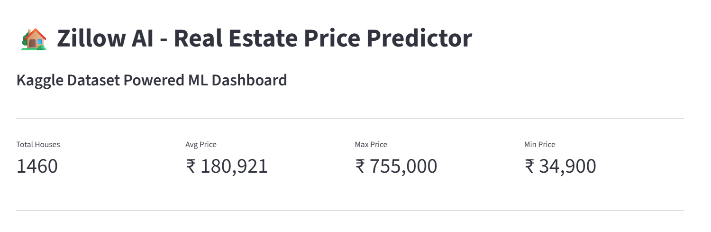
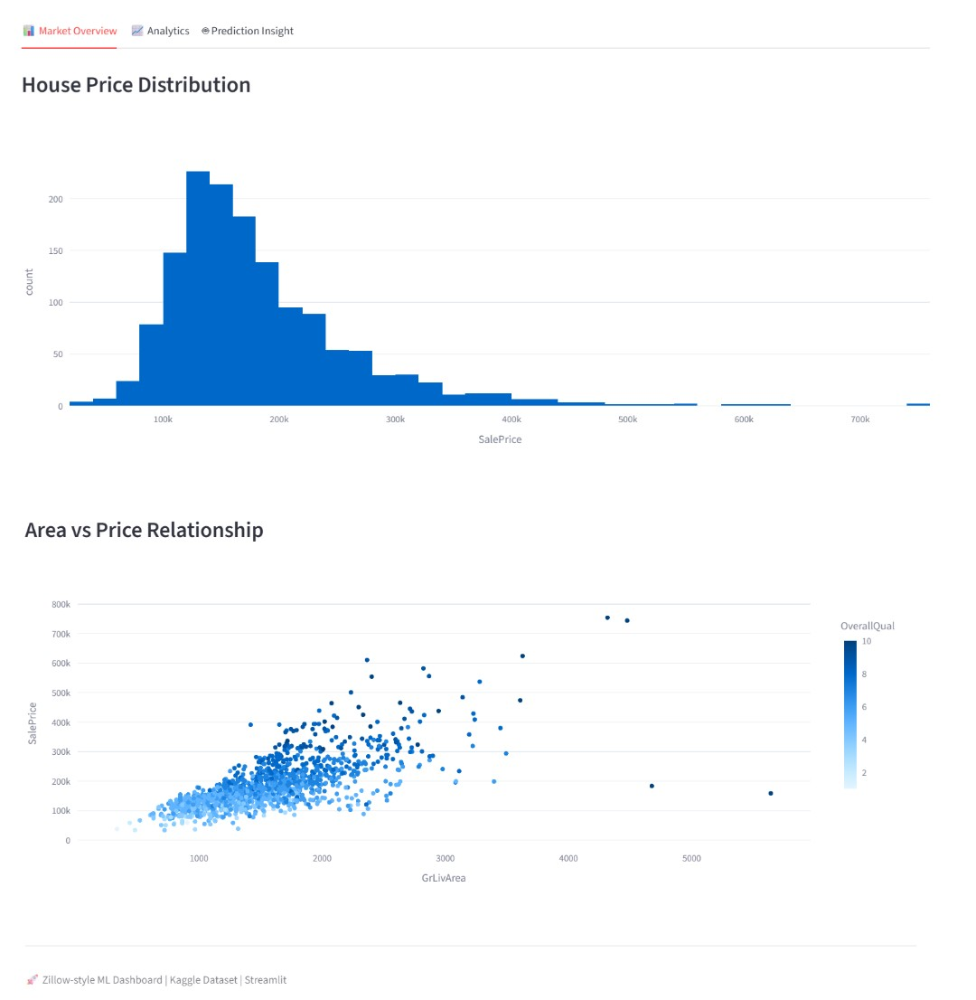
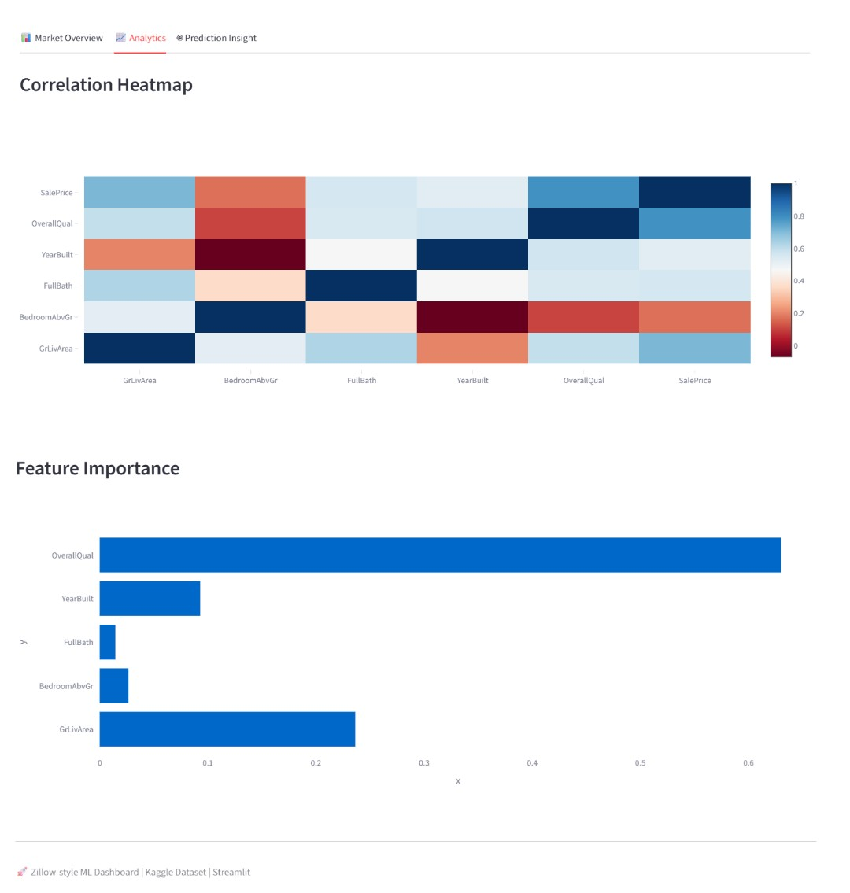
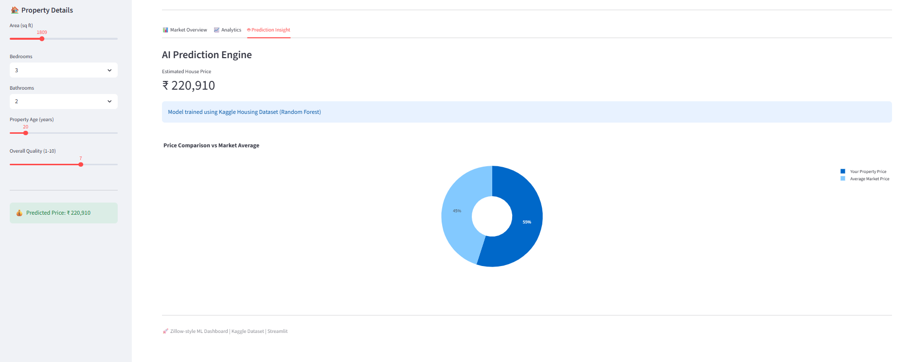

## 🏡 House Price Prediction – Zillow AI Dashboard

An **end-to-end Machine Learning project** that predicts house prices using advanced regression models and presents insights through a **premium Zillow-style Streamlit dashboard**.

🚀 Built with real-world dataset, interactive UI, and production-ready deployment.

---

## 🔗 Live Demo

👉 https://house-price-predictor-wsxvecfej3szks267g8q4i.streamlit.app/

---

## 📌 Project Highlights

✔ End-to-end ML pipeline (data → model → deployment)  
✔ Clean & modern **Zillow-inspired UI**  
✔ Real dataset from Kaggle  
✔ Interactive charts & analytics  
✔ Real-time price prediction  
✔ Fully deployed on cloud  

---

## 🧠 Problem Statement

Accurately predicting house prices is critical for:

- Buyers → fair price estimation  
- Sellers → competitive pricing  
- Real estate platforms → smart recommendations  

This project solves it using **Machine Learning + Data Visualization**.

---

## ⚙️ Tech Stack

- **Language:** Python  
- **Libraries:** Pandas, NumPy, Scikit-learn  
- **Visualization:** Plotly  
- **Frontend:** Streamlit  
- **Deployment:** Streamlit Cloud  

---

## 📊 Features

### 🏠 Property Input (Sidebar)
- Area (sq ft)
- Bedrooms
- Bathrooms
- Property Age
- Overall Quality

---

### 📊 Market Overview
- Price distribution histogram  
- Area vs Price scatter plot  

---

### 📈 Analytics Dashboard
- Correlation heatmap  
- Feature importance chart  

---

### 🤖 AI Prediction Engine
- Real-time house price prediction  
- Market comparison (Pie Chart)  
- Smart visualization of prediction  

---

## 🧾 Dataset

- Source: Kaggle Housing Dataset  

Key Features Used:
- GrLivArea  
- BedroomAbvGr  
- FullBath  
- YearBuilt  
- OverallQual  
- SalePrice (Target)  

---

## 🏗️ Project Structure

```bash
House-Price-Prediction/
│
├── app.py
├── requirements.txt
├── README.md
│
├── data/
│   └── train.csv
│
├── models/
│   └── house_price_model.pkl
│
├── images/
│   ├── dashboard.png
│   ├── market_overview.png
│   ├── analytics_dashboard.png
│   └── prediction_dashboard.png
```

---

## 📸 Screenshots

### 🏡 Dashboard


### 📊 Market Overview


### 📈 Analytics


### 🤖 Prediction


---

## 🚀 How to Run Locally

### 1️⃣ Clone Repository
```bash
git clone https://github.com/needhi-x/House-Price-Predictor.git
cd House-Price-Prediction
```

### 2️⃣ Install Dependencies
```bash
pip install -r requirements.txt
```

### 3️⃣ Run App
```bash
streamlit run app.py
```

---

## 🧠 Machine Learning Model

- Model Used: Random Forest Regressor  
- Handles non-linear relationships effectively  
- Provides feature importance insights  
- Trained on real-world housing dataset  

---

## 📈 Future Improvements

- Add deep learning model  
- Location-based price prediction (maps)  
- User authentication system  
- Downloadable PDF reports  
- API integration  

---


## ⭐ If you like this project

Give it a ⭐ on GitHub and share your feedback!

---

## 🚀 Author

**Nidhi Apotikar**  

